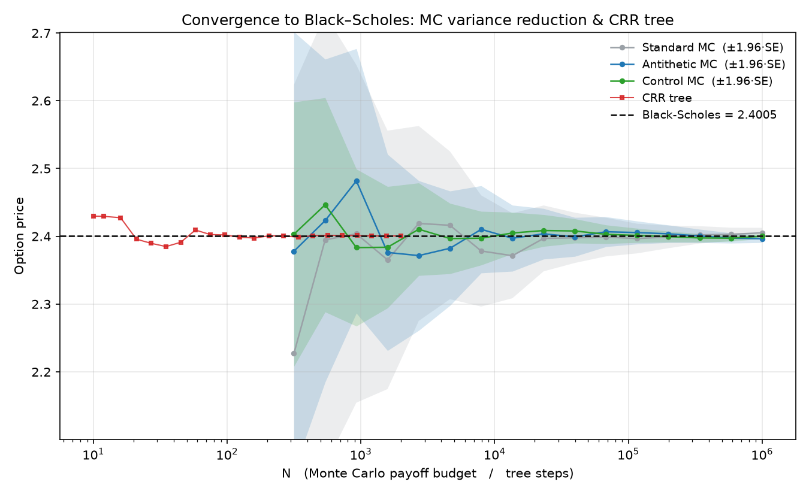
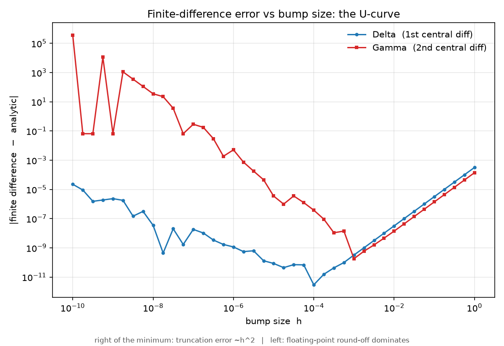
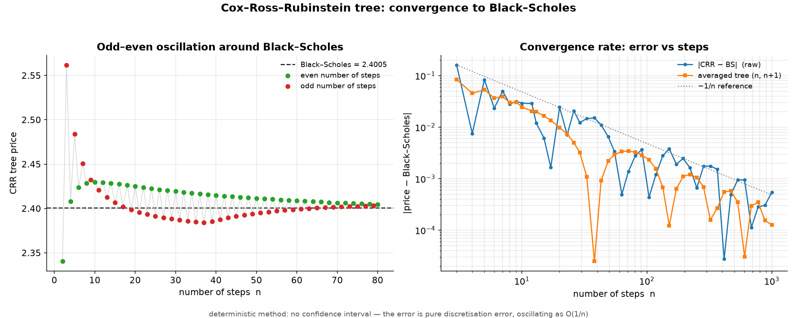
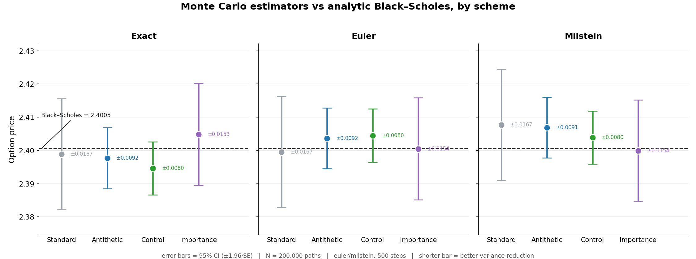

# European Option Pricing Engine

A small, self-contained Python engine that prices **European vanilla options** three independent
ways — closed-form **Black–Scholes**, **Monte Carlo** (several variance-reduction techniques and
discretisation schemes), and a **Cox–Ross–Rubinstein** binomial tree — plus a set of
convergence/validation plots showing all three methods agreeing on the same price.

The design is object-oriented and immutable at the data layer: market and contract parameters are
**frozen dataclasses** (`MarketData`, `VanillaOption`), and each pricing method is its own class
sharing those same inputs.

> The default example throughout the code (`S=49, K=50, r=5%, σ=20%, T=20/52`) is **John Hull's
> textbook example** — the analytic call is ≈ **2.40**, which makes it a convenient published
> reference for testing (see [Validation](#validation--reference-values)).

---

## Features

- **Analytic Black–Scholes** price + full Greeks ($\Delta$, $\Gamma$, $\Theta$, ν, $\rho$) for calls and puts.
- **Monte Carlo** pricer with:
  - three path schemes: `exact` (exact GBM step), `euler`, `milstein`;
  - four estimators: **standard**, **antithetic variates**, **control variates** (terminal stock
    price as control), **importance sampling**;
  - a 95% confidence interval (±1.96·SE) reported on every estimate.
- **Cox–Ross–Rubinstein** binomial tree (vectorised over the terminal layer via the binomial pmf).
- **Validation suite**: three plotting scripts demonstrating convergence to the analytic price and
  the finite-difference Greek-error "U-curve".

## Methods at a glance

| Method        | Type          | Error behaviour                                | Good for                                   |
|---------------|---------------|------------------------------------------------|--------------------------------------------|
| Black–Scholes | closed form   | exact                                          | ground truth / fast Greeks                 |
| Monte Carlo   | stochastic    | `O(1/√N)`, CI shrinks with variance reduction  | path-dependent generalisations, flexibility|
| CRR tree      | deterministic | `O(1/n)`, with odd–even oscillation            | early-exercise generalisations, intuition  |

---

## Project structure

```
.
├── pyproject.toml            # build config, dependencies, pytest/ruff settings
├── requirements.txt          # exact pinned versions for reproducible installs
├── README.md
├── LICENSE
├── src/
│   └── option_pricing/
│       ├── __init__.py       # public API re-exports
│       └── pricing.py        # core engine: MarketData, VanillaOption, the three pricers
├── scripts/                  # validation / convergence plots
│   ├── ConvergencePlot.py        # Fig 1: MC + tree converging to BS; Fig 2: Greek FD-error U-curve
│   ├── CoxRossRubensteinTree.py  # CRR odd–even oscillation + O(1/n) convergence rate
│   └── ErrorBars.py              # MC estimator comparison across schemes (price ± 95% CI)
├── tests/
│   └── test_pricing.py       # Black–Scholes vs Hull, parity, Greeks, MC/CRR convergence
└── .github/
    └── workflows/
        └── ci.yml            # ruff + pytest on Python 3.10–3.12
```

The engine lives in `src/option_pricing/`. Scripts and tests import it as the installed
`OptionPricing` package (see [Installation](#installation)), so they don't need to sit next to it.

---

## Installation

```bash
git clone https://github.com/federicoticali/OptionPricingEngine.git
cd OptionPricingEngine
python -m venv .venv && source .venv/bin/activate    # Windows: .venv\Scripts\activate
pip install -e ".[dev]"      # package (editable) + numpy/scipy/matplotlib + pytest/ruff
```

`pip install -e .` (without `[dev]`) is enough just to use the library; add `[dev]` to also get the
test and lint tools. Run the test suite with `pytest`.

---

## Quick start

```python
from option_pricing import (
    MarketData, VanillaOption,
    BlackScholesPricer, MonteCarloPricer, CoxRossRubensteinPricer,
)

# Hull's textbook example: S = 49, K = 50, r = 5%, sigma = 20%, T = 20 weeks
market = MarketData(S = 49, r = 0.05, sigma = 0.20)
option = VanillaOption(K = 50, T = 20 / 52, option_type = "call")

# 1) Analytic Black–Scholes + Greeks
bs = BlackScholesPricer(market, option)
print(bs.price_n_greeks())          # price ~ 2.40

# 2) Monte Carlo with control variates
mc = MonteCarloPricer(market, option)
mc.scheme, mc.n_paths = "exact", 500_000
price, se = mc.PricingMC(variance_reduction = "control")
print(f"{price:.4f} ± {1.96 * se:.4f}")

# 3) Cox–Ross–Rubinstein binomial tree
tree = CoxRossRubensteinPricer(market, option)
tree.n_steps = 500
print(tree.CoxRossRubensteinTree())
```

---

## Reproducing the figures

Run from the repo root (each script writes its PNG(s) to the current directory):

```bash
python scripts/ConvergencePlot.py          # -> price_convergence.png, greeks_fd_error.png
python scripts/CoxRossRubensteinTree.py    # -> crr_convergence.png
python scripts/ErrorBars.py                # -> methods_comparison.png
```

- **`price_convergence.png`** — the three MC estimators (with ±1.96·SE bands) and the CRR tree all
  converging to the analytic Black–Scholes line as the budget grows.
- **`greeks_fd_error.png`** — the finite-difference error of Δ and Γ vs the bump size `h`: the
  classic U-curve (truncation error `~h²` on the way down, floating-point round-off on the way up).
- **`crr_convergence.png`** — left: the odd–even oscillation of the tree price around BS; right:
  `|tree − BS|` decaying as `O(1/n)`, and how averaging consecutive trees `(n, n+1)` cancels the
  oscillation.
- **`methods_comparison.png`** — one panel per scheme (exact / euler / milstein); each estimator
  shown as a point with its 95% CI. Shorter bar = better variance reduction.










---

## Validation & reference values

For **European** options you don't need external market data to check correctness: the **analytic
Black–Scholes price is the ground truth**, and both Monte Carlo and the CRR tree must converge to it
(this is exactly what the plots show). The default parameters are Hull's example, so the engine can
also be checked against the textbook's published numbers:

| Quantity            | Value (Hull example) |                  
|---------------------|----------------------|
| Call price          | ≈ 2.40               |
| Δ (delta)           | ≈ 0.522              |
| Γ (gamma)           | ≈ 0.066              |    
| ν (vega, per 100%)  | ≈ 12.1               |
| Θ (theta, per year) | ≈ −4.31              |
| ρ (rho)             | ≈ 8.91               |


| Quantity            | Value (Hull example) |                  
|---------------------|----------------------|
| Put price           | ≈ 2.44               |
| Δ (delta)           | ≈ -0.478             |
| Γ (gamma)           | ≈ 0.066              |
| ν (vega, per 100%)  | ≈ 12.1               |
| Θ (theta, per year) | ≈ −1.85              |
| ρ (rho)             | ≈ -9.96              |

Good things to assert in a test suite:

- BS price/Greeks vs the table above (and vs a finite-difference Greek for a sanity bound);
- **put–call parity**: $C − P = S − Ke^{−rT}$ (internal consistency, no data needed);
- MC estimate within its own 95% CI of the BS price for each scheme/estimator;
- CRR price within an $O(1/n)$ tolerance of BS;
- cross-check against an independent library (e.g. **QuantLib**) on the same inputs.

---

## TODO / Roadmap

- [ ] **Dividends.** Add a continuous dividend yield $q$ (Merton extension): use the drift $r − q$
      everywhere — BS becomes $Se^{−qT}N(d_1)−Ke^{−rT}N(d_2)%$, the MC terminal draw uses
      $\left(r − q − \frac{\sigma^2}{2}\right)$, and the CRR risk-neutral probability becomes $p = \frac{e^{(r−q)Δt} − d}{u − d}.
      Later step: discrete cash dividends (escrowed-spot or proportional approximation for the tree).
- [ ] Extend to **American** options (the CRR tree gives the natural backward-induction route) and to
      a continuous dividend yield $q$
- [ ] A C++ version of this project is expected to be realized in future.

---

## References

- J. C. Hull, *Options, Futures, and Other Derivatives* — source of the `S=49 / K=50 / r=5% /
  σ=20% / T=20-week` example and its Greeks.
- F. Black & M. Scholes (1973); R. C. Merton (1973).
- J. C. Cox, S. A. Ross & M. Rubinstein (1979), *Option Pricing: A Simplified Approach*.
- P. Glasserman, *Monte Carlo Methods in Financial Engineering* (variance-reduction techniques).

---

## License

Released under the MIT License — see `LICENSE`.
